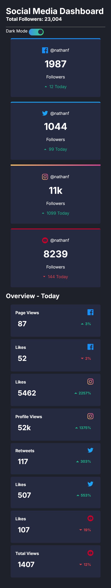
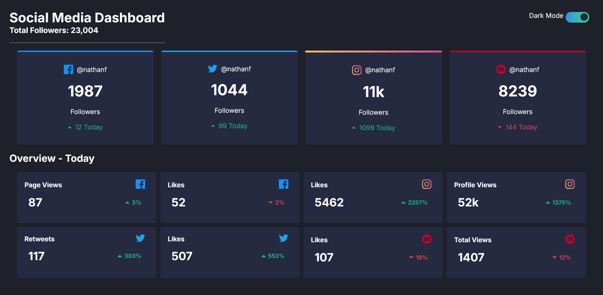
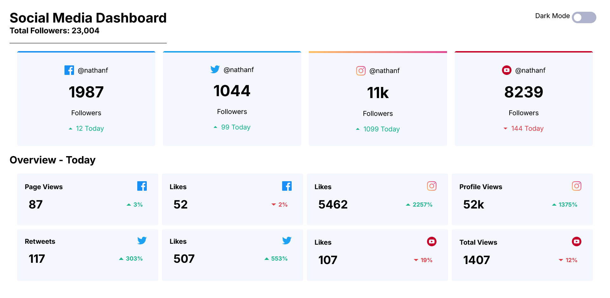

# 📊 Frontend Mentor - Social Media Dashboard with Theme Switcher


---

## 🌐 Live Preview

👉 [**View Site on GitHub Pages**](https://dukee27.github.io/Projects/social-media-dashboard-with-theme-switcher-master/index.html)

---

## 📋 Overview

This is my solution to the [Social Media Dashboard with Theme Switcher challenge on Frontend Mentor](https://www.frontendmentor.io/challenges/social-media-dashboard-with-theme-switcher-C8shhU).  
The project is a responsive dashboard that allows toggling between light and dark themes.

---

### ✅ Features

- 🔁 Responsive layout (mobile and desktop)
- 🌗 Dark/Light mode toggle switch
- 🧱 Semantic and accessible HTML5 structure
- ✨ Hover states for interactive elements

---

## 🛠️ Built With

- **HTML5**
- **CSS3** (with CSS custom properties / variables)
- **Flexbox**
- **JavaScript** (basic DOM manipulation)
- **Media Queries** for responsiveness

---

## 📸 Screenshots

| 🌙 Dark Mode (Mobile & Stretched) | ☀️ Light Mode (Mobile & Stretched) |
|----------------------------------|-----------------------------------|
|  |  |
|    |    |

---

## 🧠 What I Learned

- How to **toggle themes** using JavaScript and apply classes conditionally
- Efficiently using **CSS custom properties** for color themes
- Responsive design using **Flexbox** and **media queries**

---

## 💻 Getting Started

To run the project locally:

```bash
git clone https://github.com/dukee27/Projects.git
cd Projects/social-media-dashboard-with-theme-switcher-master
start index.html
```

---

## 👨‍💻 Author

- GitHub: [@dukee27](https://github.com/dukee27)
- Challenge: [Frontend Mentor](https://www.frontendmentor.io)

---